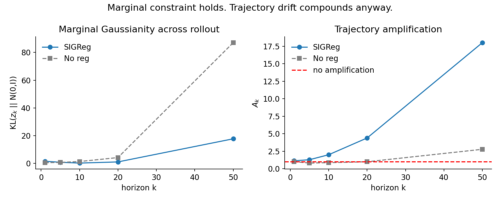
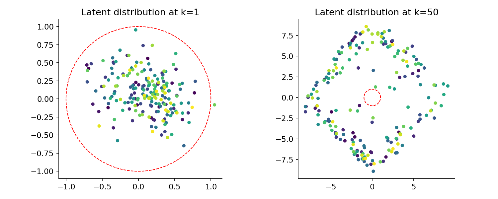

# Marginal Stability vs. Trajectory Drift

A minimal synthetic experiment showing that regularizing a world model's latent
*marginal* distribution toward N(0,I) (à la SIGReg) does not prevent drift from
compounding during autoregressive rollout.

Run with `python3 drift_experiment.py` (CPU, ~10s, seed 42).

## Setup

- Ground truth: 2D latent with mildly expanding spiral dynamics
  (`z_{t+1} = A z_t + B*action + noise`, A = rotation × 1.05 expansion),
  observed through Gaussian noise (pixel-encoder stand-in).
- Two models, identical MLP encoder/predictor architectures:
  - **SIGReg**: MSE + λ·KL(q(z) ‖ N(0,I)), trained through a 20-step rollout chain
    so the penalty constrains the *predicted* marginal at every link, not just
    the encoder's single-step output.
  - **No reg**: MSE only.
- At horizons k = 1, 5, 10, 20, 50, measured:
  - **KL**: how far the rolled-out marginal {z_k} is from a fitted diagonal Gaussian vs. N(0,I)
  - **A_k**: amplification ratio — how much a small perturbation to the initial
    observation gets blown up after k autoregressive steps, relative to the
    encoder's single-step sensitivity to the same perturbation.

## Results

```
k  | KL_sigreg | Ak_sigreg | KL_noreg | Ak_noreg
1  |   1.48    |   1.13    |   0.43   |   1.02
5  |   0.75    |   1.29    |   0.66   |   0.81
10 |   0.15    |   2.00    |   1.28   |   0.87
20 |   1.01    |   4.40    |   4.15   |   0.99
50 |  17.68    |  18.02    |  87.05   |   2.78
```




## Key insights

1. **The regularizer does what it's trained to do.** SIGReg's rollout marginal
   stays far closer to N(0,I) than the unregularized model's at every horizon —
   roughly 5x lower KL at k=50, and much flatter through the middle horizons.
   The "marginal Gaussianity" constraint genuinely holds under rollout.

2. **...and that constraint buys you nothing against trajectory drift.**
   Despite the well-behaved marginal, SIGReg's amplification ratio A_k still
   climbs sharply — from 1.13 at k=1 to 18.0 at k=50 — actually *growing faster*
   than the unregularized model's (1.02 → 2.78). A clean population-level
   statistic coexists with severe instability at the level of individual
   trajectories. Constraining where the latents *land on average* says nothing
   about how sensitively they get there.

3. **Aggregate statistics can actively mislead you about representational health.**
   The k=50 scatter plot is the sharpest illustration: the SIGReg latents have
   spread from a tight isotropic blob (k=1) into a ring/diamond-shaped manifold
   (k=50) — visibly *not* Gaussian — yet its first and second moments still
   roughly match a standard Gaussian, so the scalar KL-to-diagonal-Gaussian
   metric reports only a moderate value. A metric that only checks moments
   cannot detect this kind of shape collapse, and a model can pass it while its
   rollout has already qualitatively broken down.

**Bottom line:** a marginal regularizer is necessary-looking but not
sufficient evidence of a trustworthy world model. Evaluating drift requires
looking at trajectory-level sensitivity (and the actual shape of the rollout
distribution), not just whether single-step or population-level statistics
look clean.

## Files

- `drift_experiment.py` — full experiment (data generation, training, measurement, plotting)
- `money_figure.png` — KL and A_k vs. horizon, both models
- `latent_viz.png` — SIGReg latent scatter at k=1 vs. k=50
- `findings.txt` — results-section-style interpretation (3-4 sentences)
